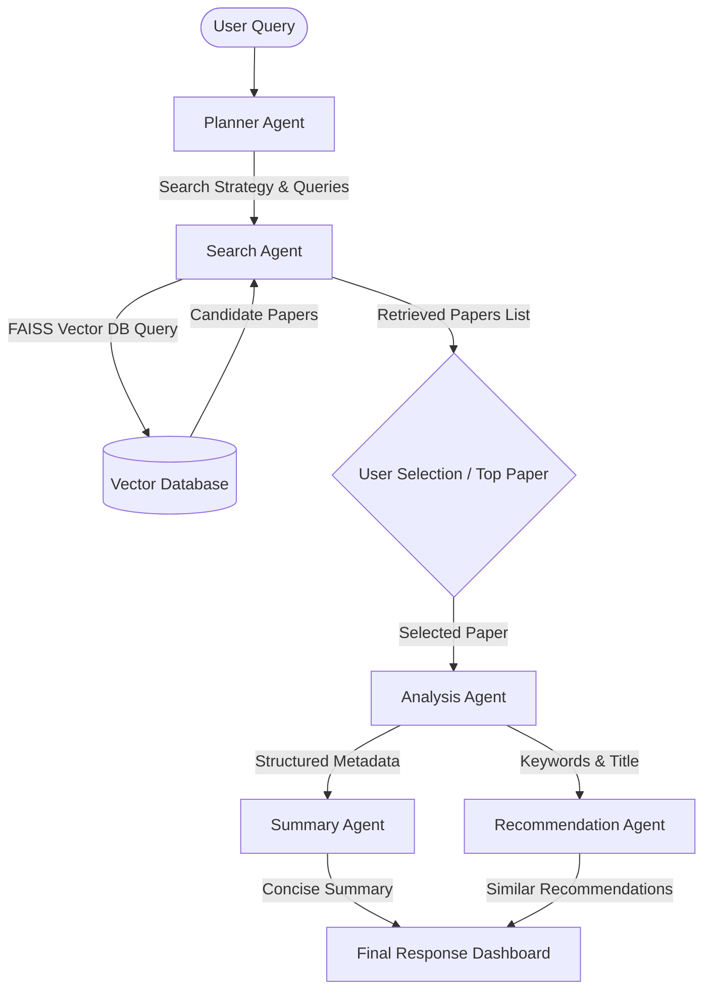

# Agentic AI Research Paper Assistant

An interactive research paper assistant that organizes the search, analysis, summarization, and recommendation of Machine Learning research papers using a coordinated team of AI agents. The system utilizes a corpus of 50,000 ArXiv Machine Learning abstracts indexed in a FAISS vector database and orchestrates Google Gemini models to automate the discovery and analysis process.

---

## Project Overview

This project is the evolution of the AI Research Paper Intelligence System (Project 2). Instead of a simple search-and-display workflow, this version implements an agent-based architecture where multiple specialized agents cooperate to fulfill a user's research query.

---

## Problem Statement

Traditional research paper search engines rely on simple keyword matching or flat semantic retrieval. When a researcher has a complex query, they must:
1. Manually break down their query into multiple keyword searches.
2. Read through multiple abstracts to verify relevance.
3. Extract contributions, authors, and keywords from the text manually.
4. Search for related citations and papers individually.

This manual orchestration slows down scientific research and literature reviews.

---

## Solution

The Agentic AI Research Paper Assistant automates this workflow by using five specialized agents:
1. **Planner Agent**: Interprets the user's research query, explains the search strategy, and generates multiple search queries.
2. **Search Agent**: Queries the FAISS index to find candidate papers and merges/deduplicates the results.
3. **Analysis Agent**: Extracts structured paper details (Title, Authors, Keywords, Main Contribution) from the abstract using Gemini.
4. **Summary Agent**: Writes a concise, human-readable summary of the paper.
5. **Recommendation Agent**: Queries the database to suggest similar papers.

---

## Features

* **Sequential Agentic Workflow**: Orchestrated steps using Google Gemini models.
* **Structured Information Extraction**: Automated parsing of titles, authors, keywords, and primary contributions without manual effort.
* **Semantic Search**: Powered by Sentence-Transformers and a local FAISS index for high-speed retrieval.
* **Interactive UI Dashboard**: Streamlit interface displaying the intermediate thoughts and outputs of each agent in real-time.
* **Dual Execution Mode**: Automatic fallback to local models (BART for summarization, KeyBERT for keywords) if the Gemini API key is not configured.

---

## Architecture

The following diagram illustrates the agentic pipeline:



---

## Folder Structure

```
Agentic-AI-Research-Paper-Assistant/
├── README.md
├── requirements.txt
├── .gitignore
├── .env
├── data/
│   ├── README.md
│   ├── cleaned_arxiv_papers.csv
│   ├── arxiv_embeddings.npy
│   └── paper_faiss.index
├── notebooks/
│   ├── 01_EDA_and_Embeddings.ipynb
│   └── 02_Search_Engine.ipynb
└── src/
    ├── app.py
    ├── build_index.py
    ├── data_prep.py
    ├── search_engine.py
    └── agents/
        ├── planner_agent.py
        ├── search_agent.py
        ├── analysis_agent.py
        ├── summary_agent.py
        └── recommendation_agent.py
```

---

## Installation

### 1. Prerequisites
Ensure you have Python 3.10+ installed (compatible with Python 3.14.0).

### 2. Install Dependencies
```bash
pip install -r requirements.txt
python -m spacy download en_core_web_sm
```

### 3. Configure API Key
Create a `.env` file in the root directory and add your Google Gemini API key:
```env
GEMINI_API_KEY=your_gemini_api_key_here
```

### 4. Build the Search Index
Run the initialization scripts to download the ArXiv dataset (capped at 1,000 papers for fast development, adjustable in `src/data_prep.py`), generate embeddings, and build the FAISS vector index.
```bash
python src/data_prep.py
python src/build_index.py
```

---

## Usage

Launch the interactive Streamlit application:
```bash
streamlit run src/app.py
```
Open your browser to `http://localhost:8501`. Enter a query, run the search, and view the live execution of the agents.

---

## Tech Stack

* **Language Model SDK**: `google-genai` (utilizing `gemini-2.5-flash` for planning and analysis)
* **Embedding Model**: `sentence-transformers/all-MiniLM-L6-v2`
* **Vector Index**: `faiss-cpu` (using L2-normalized Inner Product similarity)
* **Local Fallback Models**: `transformers` (`distilbart-cnn-12-6` for summarization), `keybert` (for keyword extraction), and `spacy` (`en_core_web_sm` for entity recognition)
* **Frontend UI**: `streamlit`
* **Configuration**: `python-dotenv`

---

## Future Scope

* **Citation Graph Integration**: Track reference connections to trace how ideas propagate between papers.
* **Support for Full-Text PDFs**: Expand analysis from abstracts to full paper PDFs for deeper insights.
* **Hierarchical Vector Search**: Implement hierarchical indexes (e.g., HNSW) to scale performance to millions of papers.
* **Multi-Modal Analysis**: Enable agents to read tables, charts, and figures inside papers.
